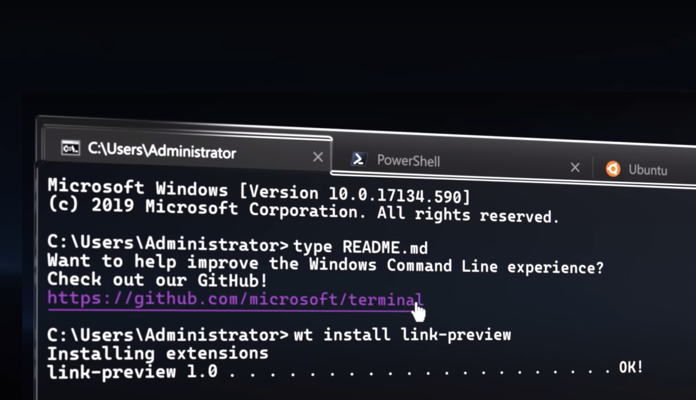

# What is CommandCore?



A simple command line parsing library that helps creating CLI apps using MVC pattern.

There are many command line parsing libraries out there, but most of them are unnecessarily complicated. Command Core library is built using a well-understood desing pattern: MVC. It cleanly separates the building blocks and makes the CLI development a scalable, extensible, and more importantly simpler endeavor. 

Each verb and their arguments are represented with three simple classes inheriting from the following base classes: `Verb`, `VerbView`, and `VerbOptions`. The verbs are parsed into these classes and the clases are populated with the necessary properties for the consumers to access. For instance, your Verb class will include a property called `Options` through which you can easily access the CLI arguments passed as part of the verb.

### Under active development!
> This library has not been published yet. The readme.md file explains the vision of this library. It may change in the future. However, the idea of this library will always be the same: Make CLI development easier and simpler.


## How to use it?

Let's start with a simple command:

```bash
helloworld.exe add --name tarik --lastname guney
```
If we disect the command call above, these are the pieces of it:
- `add`: The verb of the command. It is also known as `subcommand`.
- `--name` and `--lastname`: These are the parameter names, or option names. 
- `tarik` and `guney`: These are the arguments or parameter values.

You will see that these names are used in the library classes, as well.

You can represent and parse the command above with the following classes:

```c#
[VerbName("add")]
public class Add : Verb<AddOptions>
{
    public VerbView Run(){
        return AddView(Options);
    }
}

public class AddView : VerbView
{
    public override StringBuilder Write(){
        var outputBuilder = new StringBuilder();
        builder.Append($"Name: {Model.FirstName} {Environment.NewLine}");
        builder.Append($"Name: {Model.LastName} {Environment.NewLine}");
        return outputBuilder;
    }
}

public class AddOptions : VerbOptions
{
    [InputName("firstname")]
    public string? FirstName {get;set;}
    
    [InputName("lastname")]
    public string? LastName {get;set;}
}
```

To activate this library, you need to add the following code to the `Main` function in `Program.cs` file:

```c#
public static int Main(string[] args)
{
    return CommandCore.Parse(args);
}
```

That's all, and it will be all. The whole idea of this library is to simplify the console application command line argument parsing.

## Roadmap

1. Add routing mechanism, similar to Asp.NET Core MVC. Routing mechanism will help verbs to be routed to a desired class pattern for more complicated scenarios.
2. Add a middleware, which is similar to Asp.NET Core MVC request/response middleware features, which allows the developers to inject logic between a command is routed to its handling verb (controller).

## Developed

by Tarik Guney with .NET Core 3.x.
